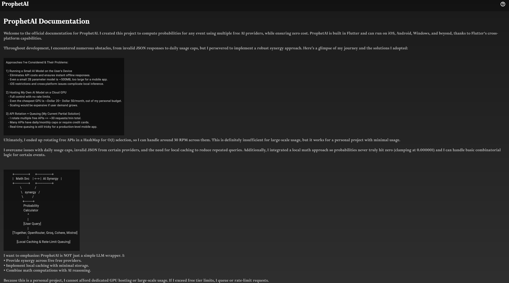

# ProphetAI

[](https://flutter.dev)  
[](https://firebase.google.com)  

## Overview  

**ProphetAI** is a web-based AI-powered probability calculator with 2000+ users that determines the likelihood of any given scenario by leveraging multiple free AI APIs. The app uses a synergy approach to balance API limits and combines AI-generated insights with mathematical logic.  

It is designed as a cross-platform **Flutter web app**, supporting both desktop and mobile devices.  

---

## 🚀 Features  

✅ **Multi-API Synergy** – Uses Together, OpenRouter, Groq, Cohere, and Mistral APIs.  
✅ **Hybrid Reasoning** – Blends AI-generated responses with mathematical calculations.  
✅ **Local Caching** – Stores results locally to reduce API requests and improve efficiency.  
✅ **Rate Limiting & Queueing** – Ensures free-tier APIs do not exceed their limits.  
✅ **Dynamic UI** – Smooth animations, dark mode support, and mobile responsiveness.  
✅ **Firebase Integration** – Used for hosting and deployment.  

---

## 🛠️ Technical Architecture  

### **Frontend (Flutter Web)**  
- **Framework:** Flutter 3.19.6 (Dart 3.3.4)  
- **State Management:** `provider` package  
- **UI:** Built using Flutter widgets with a responsive design for mobile & desktop  
- **Networking:** HTTP requests via `http` package  

### **Backend (AI API Synergy System)**  
- **API Requests:** Rotates between multiple AI APIs based on availability  
- **Load Balancing:** Uses a round-robin approach to distribute requests  
- **Error Handling:** Automatic failover to the next API if one fails  
- **Probability Calculations:** Uses mathematical models if AI-generated probability is missing  

---

## 📌 How It Works  

### **User Flow**  
1. User enters a question (e.g., *"What are the odds of meeting someone with the same birthday?"*)  
2. ProphetAI selects an AI provider using internal ranking & availability check  
3. API request is made with necessary parameters  
4. **Response Processing:**  
   - AI-generated probability is extracted  
   - If missing, mathematical calculations are applied  
5. Result is displayed with **confidence scores & explanations**  
6. Query & result are **cached** locally for optimization  

### **Synergy-Based API Selection**  




🔄 **Round-Robin Selection** – Cycles through available APIs  
🔄 **Failover Handling** – Retries with another API if one fails  
🔄 **Usage Monitoring** – Limits requests to avoid exceeding free-tier limits  

### **Mathematical Probability Calculation**  
📊 **Bayesian Inference** – Used for refining estimates  
📊 **Combinatorics & Permutations** – Applied to probability-based questions  
📊 **Monte Carlo Simulations** – Used for complex multi-variable scenarios  

---

## 🚀 Deployment & CI/CD Pipeline  

### **Firebase Hosting**  
✅ Deployed on Firebase Hosting for **fast & scalable performance**  
✅ Uses Firebase’s **global CDN** for quick load times  
✅ Firebase CLI handles deployments  

### **GitHub Actions for CI/CD**  
🔹 **On Pull Request:**  
- Runs Flutter tests  
- Builds the web app  

🔹 **On Merge to `main`:**  
- Deploys the updated version to Firebase  

---

## 🛠️ Local Development Setup  

### **Prerequisites**  
- Install Flutter SDK (**Flutter 3.19.6**)  
  ```sh
  flutter --version
  npm install -g firebase-tools
  ```
- Clone the Repo
```
git clone https://github.com/your-username/prophetai.git
cd prophetai
```
- Running Locally
  ```
  flutter pub get
  flutter run -d chrome
  ```

## ⚠️ Limitations & Future Enhancements  

### **Current Limitations:**  
⚠️ Relies on free-tier APIs, which limits scalability  
⚠️ Requires internet connectivity  
⚠️ API responses can vary in accuracy  

### **Planned Features:**  
🚀 User authentication for personalized queries  
🚀 AI fine-tuning using user feedback  
🚀 Dedicated API backend to reduce reliance on third-party services  

---

## 🎯 Conclusion  

**ProphetAI** is an innovative **AI-driven probability calculator** that provides insights into real-world and theoretical scenarios. By leveraging multiple free AI APIs and incorporating mathematical reasoning, it ensures accuracy while remaining cost-effective. The project is continuously evolving, with plans for enhanced **scalability & improved accuracy**.  

🔗 **GitHub Repository**: [ProphetAI](https://github.com/DevPatel3547/ProphetAI-)

